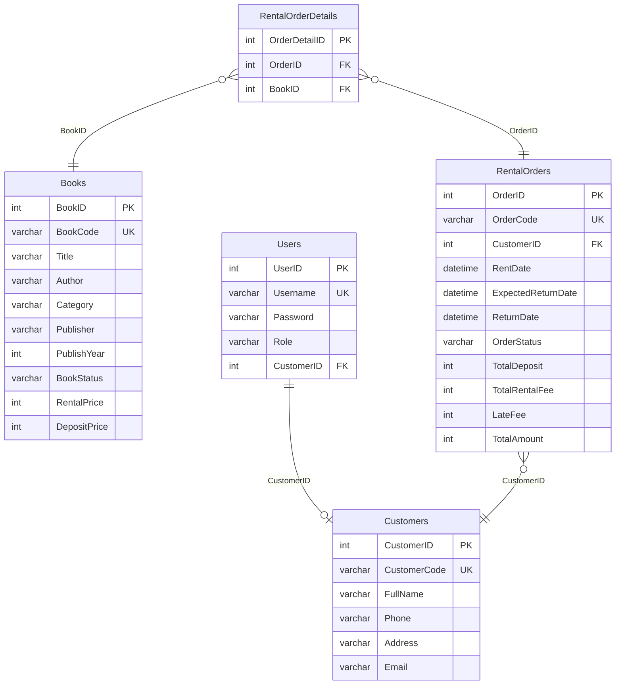
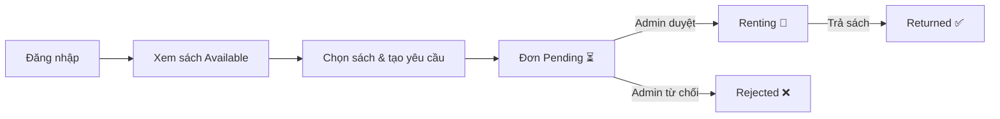
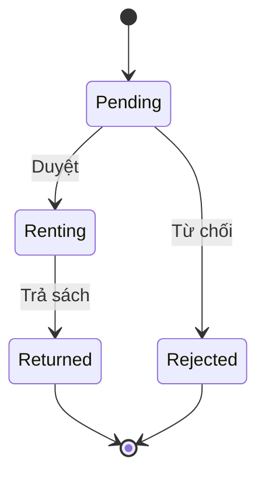
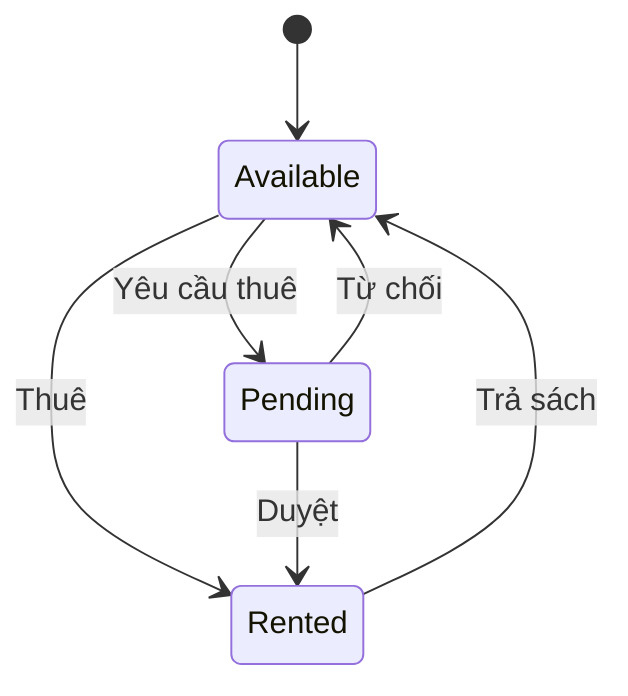

# 📘 Đặc tả Yêu cầu Phần mềm (SRS) — Libris Desktop App

| Thông tin | Chi tiết |
|---|---|
| **Phiên bản** | 2.0 |
| **Ngày tạo** | 09/08/2026 |
| **Dự án** | Java Libris Desktop App |
| **Công nghệ** | Java Swing + SQLite |
| **Mã nguồn** | `com.libris.*` |

> Tài liệu SRS đầy đủ có định dạng HTML: xem file [`SRS_Libris.html`](../SRS_Libris.html)

---

## Mục lục

1. [Giới thiệu](#1-giới-thiệu)
2. [Mô tả tổng quan](#2-mô-tả-tổng-quan)
3. [Cơ sở dữ liệu](#3-cơ-sở-dữ-liệu)
4. [Yêu cầu chức năng](#4-yêu-cầu-chức-năng)
5. [Yêu cầu phi chức năng](#5-yêu-cầu-phi-chức-năng)
6. [Ma trận chức năng theo vai trò](#6-ma-trận-chức-năng-theo-vai-trò)
7. [Luồng nghiệp vụ](#7-luồng-nghiệp-vụ)

---

## 1. Giới thiệu

### 1.1 Mục đích
Tài liệu SRS mô tả đầy đủ các yêu cầu chức năng và phi chức năng của hệ thống **Libris — Ứng dụng Quản lý Thư viện Desktop**. Tài liệu được tạo từ phân tích mã nguồn thực tế, bao gồm các package: `model`, `dao`, `controller`, `ui`, `utils`, `config`, và `helpers`.

### 1.2 Phạm vi
**Libris** là ứng dụng desktop (Java Swing) quản lý hoạt động cho thuê sách tại thư viện. Hỗ trợ 2 vai trò: **Admin** và **Customer**.

---

## 2. Mô tả tổng quan

### 2.1 Kiến trúc
Kiến trúc **MVC (Model–View–Controller)**:
```
UI (View) → Controller → DAO → Database (SQLite)
```

### 2.2 Công nghệ

| Công nghệ | Phiên bản | Vai trò |
|---|---|---|
| Java SE | 25 | Ngôn ngữ chính |
| Java Swing | — | Framework giao diện |
| SQLite | 3.53.2.0 | CSDL nhúng |
| FlatLaf | 3.7.1 | Modern Look & Feel |
| JFreeChart | 1.5.6 | Biểu đồ thống kê |
| Apache POI | 5.5.1 | Xuất Excel |

### 2.3 Cấu trúc Package

| Package | Số lớp | Chức năng |
|---|---|---|
| `model` | 7 | Thực thể dữ liệu (POJO) |
| `dao` | 6 | Truy cập CSDL (SQL queries) |
| `controller` | 6 | Nghiệp vụ trung gian |
| `ui` | 11 | Giao diện Swing |
| `utils` | 4 | Tiện ích (DB, Excel, Chart, Icon) |
| `config` | 1 | Hằng số hệ thống |
| `helpers` | 1 | Đọc file properties |

---

## 3. Cơ sở dữ liệu

### 3.1 Sơ đồ ERD



### 3.2 Ràng buộc
- **BookStatus**: `Available` | `Rented` | `Pending`
- **OrderStatus**: `Pending` | `Renting` | `Returned` | `Rejected`
- **Role**: `Admin` | `Customer`
- ExpectedReturnDate ≥ RentDate
- ReturnDate IS NULL OR ReturnDate ≥ RentDate

---

## 4. Yêu cầu chức năng

### FR-01: Đăng nhập
- **Vai trò**: Admin, Customer
- **Luồng**: `LoginView` → `AuthController` → `UserDAO.login()`
- Xác thực Username/Password, JOIN Users + Customers
- Sử dụng `SwingWorker` để không block UI
- Admin → Dashboard | Customer → Thuê sách

### FR-02: Dashboard tổng quan
- **Vai trò**: Admin
- **Luồng**: `DashboardView` → BookController, CustomerController, RentalOrderController, ReportController
- 4 thẻ thống kê: Tổng sách, Sách có sẵn, Sách đang thuê, Tổng KH
- Bảng đơn thuê gần đây (5 đơn mới nhất)
- Top 4 sách được thuê nhiều nhất

### FR-03: Quản lý sách (CRUD)
- **Vai trò**: Admin
- **Luồng**: `BooksView` → `BookController` → `BookDAO`
- Xem danh sách, Thêm, Sửa, Xóa, Tìm kiếm (Title, Author, BookCode)

### FR-04: Quản lý khách hàng (CRUD)
- **Vai trò**: Admin
- **Luồng**: `CustomersView` → `CustomerController` → `CustomerDAO`
- Xem danh sách, Thêm, Sửa, Xóa, Tìm kiếm (ID hoặc FullName)

### FR-05: Quản lý đơn thuê
- **Vai trò**: Admin
- **Luồng**: `OrdersView` → `RentalOrderController` → `RentalOrderDAO`
- Xem danh sách, Tạo đơn mới (transaction), Xem chi tiết, Duyệt/Từ chối, Trả sách
- Transaction: INSERT Order → INSERT Details → UPDATE BookStatus

### FR-06: Thuê sách (Customer)
- **Vai trò**: Customer
- **Luồng**: `RentView` → `RentController` → `RentDAO`
- Xem sách Available, Chọn sách + ngày trả, Tạo yêu cầu (Pending)

### FR-07: Sách đang thuê
- **Vai trò**: Customer
- **Luồng**: `MyRentalsView` → `RentController` → `RentDAO`
- Xem đơn thuê cá nhân (Pending/Renting), Trả sách → Returned

### FR-08: Báo cáo & Thống kê
- **Vai trò**: Admin
- **Luồng**: `ReportsView` → `ReportController` → `ReportDAO`
- Doanh thu theo tháng (biểu đồ Line Chart)
- Top sách được thuê nhiều nhất
- Thống kê theo thể loại
- Top khách hàng thuê nhiều nhất
- Danh sách sách quá hạn

### FR-09: Hồ sơ người dùng
- **Vai trò**: Customer
- **Luồng**: `ProfileView` → `AuthController` → `UserDAO`
- Xem/sửa: FullName, Email, Phone
- Đổi mật khẩu (kiểm tra mật khẩu cũ)

### FR-10: Xuất Excel
- **Vai trò**: Admin
- **Lớp**: `ExcelExporter` (Apache POI)
- Xuất: Danh sách sách, Khách hàng, Đơn thuê, Báo cáo doanh thu

---

## 5. Yêu cầu phi chức năng

| Loại | Yêu cầu |
|---|---|
| **Hiệu năng** | SwingWorker cho thao tác nặng; SQLite WAL mode; busy timeout 30s |
| **Bảo mật** | Xác thực Username/Password; Phân quyền Admin/Customer; ⚠️ Mật khẩu plain text |
| **Giao diện** | FlatLaf Look & Feel; Font Segoe UI; Cửa sổ min 1024×800; Icon SVG |
| **Dữ liệu** | SQLite file-based; Auto-init từ SQL script; Transaction cho thao tác phức hợp; FK + CHECK constraints |
| **Triển khai** | JAR đóng gói (Maven Assembly); Entry: LoginView; JRE 25+ |

---

## 6. Ma trận chức năng theo vai trò

| Chức năng | Admin | Customer |
|---|:---:|:---:|
| Đăng nhập / Đăng xuất | ✅ | ✅ |
| Dashboard tổng quan | ✅ | — |
| Quản lý sách (CRUD) | ✅ | — |
| Quản lý khách hàng (CRUD) | ✅ | — |
| Quản lý đơn thuê | ✅ | — |
| Duyệt / Từ chối đơn | ✅ | — |
| Báo cáo & Thống kê | ✅ | — |
| Xuất Excel | ✅ | — |
| Xem sách có sẵn | — | ✅ |
| Tạo yêu cầu thuê sách | — | ✅ |
| Xem sách đang thuê | — | ✅ |
| Yêu cầu trả sách | — | ✅ |
| Hồ sơ cá nhân & Đổi MK | — | ✅ |

---

## 7. Luồng nghiệp vụ

### 7.1 Luồng thuê sách



### 7.2 Trạng thái đơn thuê



### 7.3 Trạng thái sách



---

> **Tài liệu SRS đầy đủ với giao diện đẹp**: Mở file [`SRS_Libris.html`](../SRS_Libris.html) trong trình duyệt.
